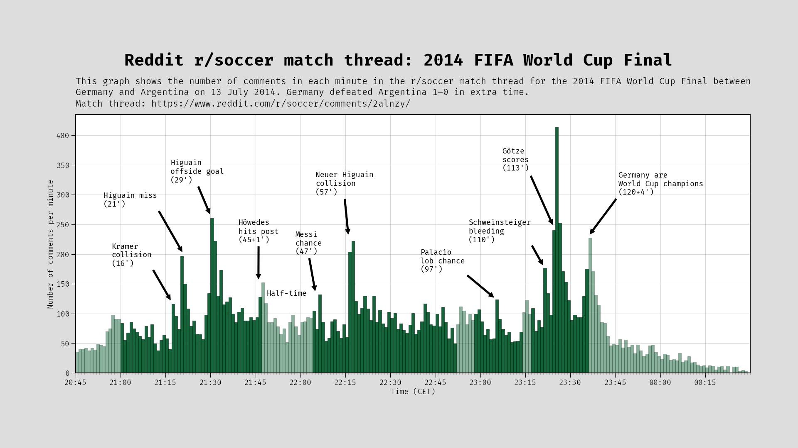
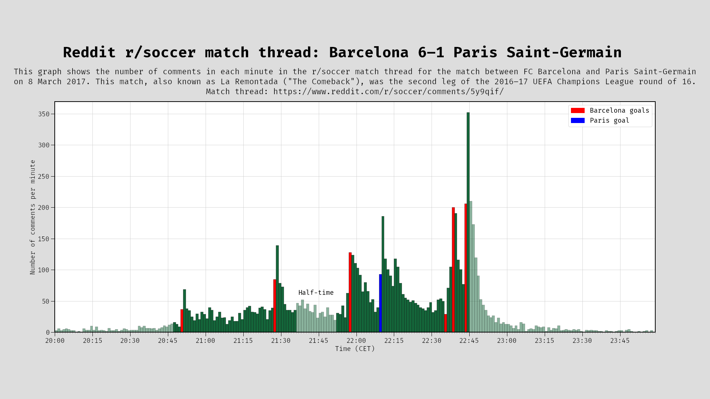

# Data analysis on Reddit data

# Reddit r/soccer match thread - Comments per minute

## Tools used

- [PRAW](https://praw.readthedocs.io/en/stable/) (Python Reddit API Wrapper)
- Jupyter Notebook
- Pandas
- Matplotlib
- Seaborn

## Example graphs

### 2014 FIFA World Cup Final between Germany and Argentina

Match thread link: [``` https://www.reddit.com/r/soccer/comments/2alnzy/match_thread_germany_vs_argentina_2014_fifa_world/ ```](https://www.reddit.com/r/soccer/comments/2alnzy/match_thread_germany_vs_argentina_2014_fifa_world/) <br>
18723 comments




### Barcelona 6–1 Paris Saint-Germain "La remontada"

Match thread link: [``` https://www.reddit.com/r/soccer/comments/5y9qif/match_thread_barcelona_vs_paris_saintgermain/ ```](https://www.reddit.com/r/soccer/comments/5y9qif/match_thread_barcelona_vs_paris_saintgermain/) <br>
8387 comments




## About this repository

I created the two graphs with the two Jupyter Notebooks you see in this repository. You can find the same code as a normal Python file in main.py.